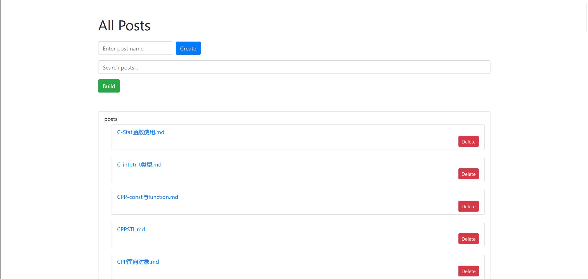
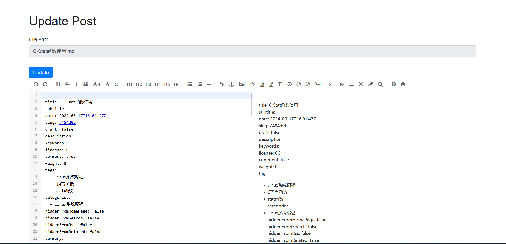
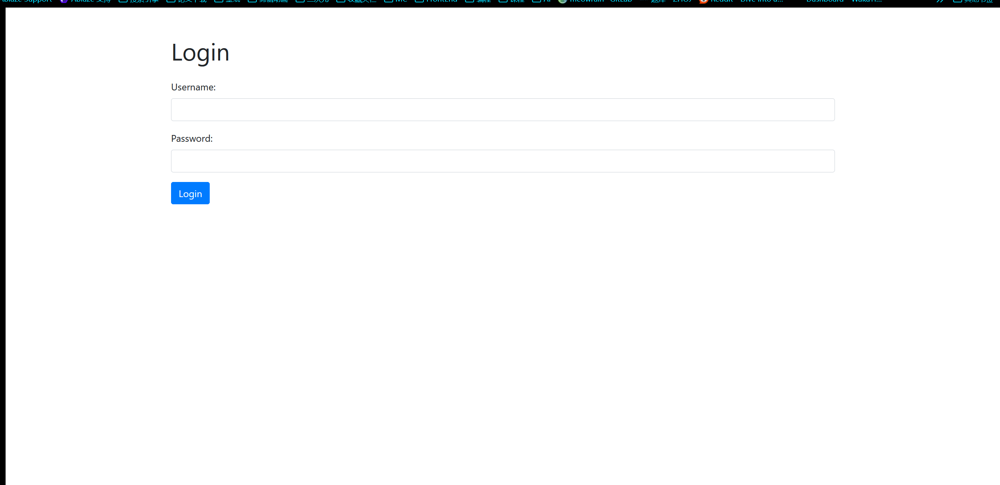

> 请自行修改scripts中deploy.sh中的配置
# 简介
这是一个基于 Gin 框架的 Hugo 后端 API 项目，提供了基本的内容管理和构建功能。
# 路由说明

## 未经认证的路由

- `GET /api`：重定向到 `/api/list`。
- `GET /api/login`：渲染登录页面。
- `POST /api/login`：处理登录请求。

## 认证保护的路由

这些路由都需要通过身份认证：

- `GET /api/list`：列出所有的帖子。
- `GET /api/update`：渲染更新页面。
- `POST /api/hugo/new`：创建一个新的内容。
- `POST /api/hugo/update`：更新现有内容。
- `POST /api/hugo/build`：构建 Hugo 项目。
- `GET /api/getContent`：获取指定文件的内容。
- `POST /api/hugo/delete`：删除指定文件。

# 项目使用
下载源码，修改config/config.yaml里面的配置

执行make进行编译，

找到对应你架构的可执行文件，然后把这个放在你的hugo根目录下，把该程序挂在后台运行

把scripts/deploy.sh中的配置修改成你自己的，然后把这个也拷贝到hugo根目录下

然后安装CaddyServer，把CaddyServer的配置文件Caddyfile拷贝到hugo根目录下，然后启动CaddyServer
```Caddyfile
example.com {
        root * hugo_directory
        file_server
        reverse_proxy /api/* 127.0.0.1:3000
}
```

```bash
caddy start
```

我们访问后端的时候，就用xxx.com/api/login 进行登录，登录后会自行进入list页面，然后就可以对文章进行编辑和发布了

# 项目展示



